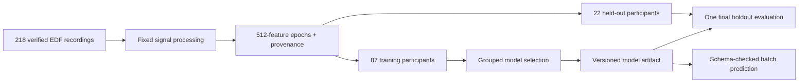

# EEG State Classifier

[](https://github.com/gitLamHoang/Classfying-brain-wave-state/actions/workflows/ci.yml)

**An auditable EEG experiment system: from verified recordings to predictions on unseen participants.**

EEG windows from the same person are correlated. A random row split can make a model look more useful than it is. This Python project keeps participants separate throughout model selection and evaluation, then packages the selected model with its exact feature schema and provenance.

The current real-data experiment distinguishes **eyes-open from eyes-closed baseline recordings** in PhysioNet's EEG Motor Movement/Imagery Dataset. It extends an earlier single-channel prototype; it does not measure sleep or drowsiness.

[Experiment protocol](docs/real_eeg_benchmark.md) · [Frozen configuration](configs/physionet_eyes_protocol.json) · [Engineering decisions](docs/product.md) · [Original synthetic demo](docs/legacy_demo.md)

## Built end to end

| Stage | Implementation |
|---|---|
| Acquire | Concurrent HTTPS downloads, retries, atomic writes, cached-file rechecks, publisher SHA-256 verification |
| Prepare | MNE EDF reader; fixed channel/rate checks; SciPy filtering and Welch spectra; explicit quality-control audit |
| Represent | 512 spectral features from 64 channels; participant, condition, run and time metadata excluded from predictors |
| Select | Eight fixed candidates across dummy, logistic, RBF SVM and random forest; five participant-disjoint folds; training-only scaling |
| Evaluate | One untouched participant holdout; confusion matrix and participant metrics; 2,000 participant-cluster bootstrap samples |
| Ship | Versioned model artifact, schema-checked batch CLI, source/input/lock hashes, immutable experiment outputs |



## Reproduce the real-data experiment

Install [uv](https://docs.astral.sh/uv/getting-started/installation/), then run on CPU:

```bash
git clone https://github.com/gitLamHoang/Classfying-brain-wave-state.git
cd Classfying-brain-wave-state
uv sync --frozen --python 3.12 --extra dev --extra benchmark

uv run python scripts/prepare_physionet.py \
  --config configs/physionet_eyes_protocol.json \
  --raw-dir data/raw/physionet \
  --output-dir data/processed/physionet

uv run python scripts/benchmark_physionet.py \
  --features data/processed/physionet/features.csv \
  --manifest data/processed/physionet/features_manifest.json \
  --output-dir reports/physionet-eyes-v1

uv run python scripts/predict_benchmark.py \
  --model reports/physionet-eyes-v1/model.joblib \
  --features data/processed/physionet/features.csv \
  --output reports/physionet-eyes-v1/batch_predictions.csv
```

The final command demonstrates batch inference over the prepared feature table; it is **not** another evaluation. The benchmark report scores only held-out participants. Use fresh preparation and benchmark output directories for a new run. Approximately 278 MB of source EDFs are downloaded. To use the dataset's official AWS mirror, add `--mirror-base-url https://physionet-open.s3.amazonaws.com/eegmmidb/1.0.0/` to preparation; publisher hashes remain authoritative.

Raw recordings, feature tables, model binaries and individual predictions are ignored by Git. Compact evidence and aggregate reports are committed. Only load trusted `joblib` artifacts; loading Python serialized objects can execute code.

## Repository map

| File | Responsibility |
|---|---|
| `src/eeg_state_classifier/physionet.py` | Verified acquisition, EDF validation, multichannel feature extraction, quality/provenance manifests |
| `src/eeg_state_classifier/benchmark.py` | Frozen protocol validation, grouped selection, holdout, confidence intervals, artifacts |
| `src/eeg_state_classifier/inference.py` | Strict feature alignment, finite-value checks, batch labels and audit sidecars |
| `configs/physionet_eyes_protocol.json` | Pre-fit experiment contract, including exact signal processing and model candidates |
| `features.py`, `modeling.py`, `io.py` | Original ten-feature single-channel workflow, kept separate |
| `tests/` | Signal invariants, corrupt-source handling, schema failures, participant isolation and provenance checks |

## Development

```bash
uv run pytest -q
uv run ruff check src scripts tests
uv run ruff format --check src scripts tests
```

CI runs offline unit tests and the complete original synthetic demo using Python 3.12 and locked dependencies. It does not redownload the public cohort or repeatedly open the scientific holdout. The legacy synthetic scores test software behavior and are never presented as performance on real participants.

## Interpretation

This is an offline research benchmark. Baseline run order is fixed, so condition and run effects are confounded; same-dataset participant separation does not establish external or cross-device validity. Zero-phase filtering uses future samples within each recording. The fixed quality checks do not remove every physiological artifact. The experiment supports no diagnosis, sleep-detection, live-streaming or state-of-the-art accuracy claim. See [full methodology and limitations](docs/real_eeg_benchmark.md).

Data: [PhysioNet EEG Motor Movement/Imagery Dataset 1.0.0](https://physionet.org/content/eegmmidb/1.0.0/), Schalk (2009), DOI [10.13026/C28G6P](https://doi.org/10.13026/C28G6P), Open Data Commons Attribution License v1.0. Full scholarly attribution is in the methodology.

The original hardware/ML project was developed with guidance from Professor Trinh Van Chien, School of Information and Communication Technology, Hanoi University of Science and Technology. The public multichannel benchmark is a subsequent engineering extension.
